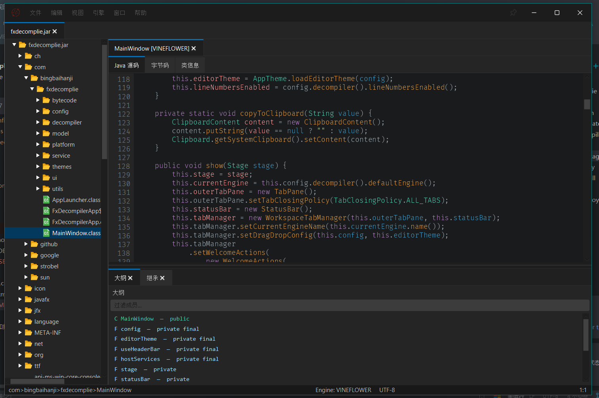

# FxDecompiler

基于 JDK 25 / JavaFX 25 的 Java 字节码反编译桌面工具。支持打开 JAR、ZIP、目录和单个 class 文件，提供多引擎反编译、字节码视图、全局搜索、用法查找、继承分析、代码导出等能力。

## 功能

- **多引擎反编译** — Vineflower / CFR / Procyon / JD-Core，一键切换，支持引擎级自定义选项
- **工作区管理** — 打开 JAR、ZIP、目录、class 文件，按包树浏览，多工作区标签页
- **代码编辑器** — 语法高亮（VS Code 主题）、行号、代码折叠、Ctrl+Click 导航跳转
- **字节码视图** — javap 风格字节码/汇编展示，与源码视图并列
- **类信息面板** — 访问标志、常量池统计、方法/字段列表
- **全局搜索** — 类名、成员、方法签名、源码全文、注释、资源文件、字节码文本，7 种搜索模式
- **Find Usages** — 基于 ASM 的类引用和方法调用分析
- **继承层次** — 父类链 + 子类发现的树状展示，双击跳转
- **结构大纲** — 字段/方法/内部类实时列表，点击跳转
- **导出** — 反编译源码导出为目录或 ZIP，支持冲突策略（覆盖/跳过/重命名）
- **多窗口** — 代码标签页可拖拽到独立窗口，跨窗口拖回
- **配置持久化** — 窗口状态、引擎偏好、主题、最近文件自动保存
- **三级缓存** — 内存缓存 + 磁盘持久化缓存，避免重复反编译
- **国际化** — 简体中文 / English 动态切换
- **暗色主题** — 内置 VS Code 暗色主题，支持外部主题 JSON

## 环境要求

- **JDK 25**（含 JavaFX 25.0.1）
- Maven 3.9+（或使用项目内置 `mvnw`）
- 操作系统：Windows / Linux / macOS

## 快速开始

```bash
# 克隆仓库
git clone https://github.com/bingbaihanji/fxdecomplie.git
cd fxdecomplie

# 编译
./mvnw clean compile -DskipTests

# 运行
./mvnw exec:java

# 打包 fat JAR（输出到 bin/fxdecomplie.jar）
./mvnw clean package -DskipTests

# 运行测试
./mvnw test
```

Windows PowerShell 用户请使用 `.\mvnw.cmd` 替代 `./mvnw`。

### 命令行参数

```bash
# 启动时自动打开指定文件
./mvnw exec:java -Dexec.args="--open /path/to/app.jar"
```

fat JAR 打包后直接运行：

```bash
java -jar bin/fxdecomplie.jar --open /path/to/app.jar
```

## 技术栈

| 类别 | 技术 |
|------|------|
| 语言 / 运行时 | Java 25 + JavaFX 25.0.1 |
| 代码编辑器 | jfx.incubator.richtext CodeArea |
| 反编译引擎 | Vineflower 1.11.2 / CFR 0.152 / Procyon 0.6.0 / JD-Core 1.1.3 |
| 字节码分析 | ASM 9.9 |
| 缓存 | 自定义 L2/L3 缓存 |
| JSON | Gson 2.12.1 |
| 日志 | SLF4J 2.0.17 + Logback 1.5.18 |
| 原生窗口 | JNA 5.17.0（Windows DWM 边框/圆角/标题栏） |
| 测试 | JUnit Jupiter 5.12.1 |
| 构建 | Maven + Shade Plugin 3.6.0（fat JAR） |

## 项目结构

```
src/main/java/com/bingbaihanji/fxdecomplie/
├── config/          # 应用配置 POJO 与 JSON 持久化
├── decompiler/      # 反编译引擎接口与实现 + 字节码缓存 + 上下文
├── model/           # 数据模型：工作区/文件树/索引/导出/导航路径
├── service/         # 业务逻辑：发现/索引/反编译/搜索/导出/导航/进程
├── ui/              # JavaFX 界面
│   ├── code/        #   代码编辑器标签页、状态栏、独立窗口
│   ├── inheritance/ #   继承层次面板
│   ├── outline/     #   结构大纲面板
│   ├── quickopen/   #   快速打开对话框
│   ├── search/      #   7 种搜索提供器 + 搜索对话框
│   ├── theme/       #   主题系统（VS Code 主题加载、正则高亮）
│   ├── tree/        #   文件树视图
│   └── usage/       #   Find Usages 对话框
└── utils/           # 国际化 / Ctrl+Click 导航
```



## 架构亮点

### 线程模型

耗时操作（发现、反编译、搜索、导出）全部通过 `BackgroundTasks` 提交到守护线程池执行，UI 更新通过 `Platform.runLater()` 回到 JavaFX Application Thread。切换类文件时先取消当前反编译任务再提交新任务，避免过期结果覆盖。

### 三级缓存

反编译结果走 `L2 内存缓存 → L3 磁盘缓存 → 实际反编译` 三级流水线。缓存键包含工作区路径 + mtime + size，防止同路径替换文件命中旧缓存。`BytecodeCache`（Caffeine）在打开 JAR 时预加载 class 字节码，供反编译器解析类型依赖时查找。

### 搜索系统

`SearchService` 聚合 7 个独立 `SearchProvider`，支持 200ms 防抖输入、组合框过滤、大小写/正则/全词匹配选项、排除路径模式、结果上限配置。

### Ctrl+Click 导航

反编译后自动从源码提取类引用映射（`CodeMetadata`），Ctrl+Click 时通过 `findNodeByPath()` 在文件树中查找目标类并递归打开。

## 配置与数据

打包运行后应用数据默认写入 JAR 所在目录：

```
<appDir>/
├── config/config.json    # 窗口/主题/引擎/导出/搜索偏好
├── cache/                # L3 磁盘反编译缓存
└── logs/                 # 应用日志
```

开发期运行回退到 `user.dir`（项目根目录）。

## 国际化

支持简体中文和英文动态切换。语言文件优先级：

1. JAR 同级目录 `language/` 文件夹（外部文件，方便用户自定义）
2. classpath `resources/language/`（内置默认）

当前包含 227 个国际化 key，覆盖全部 UI 文本。

## 维护约定

- JavaFX 线程只做 UI 更新，耗时操作一律放入 `BackgroundTasks`
- class 字节懒加载，避免打开大型 JAR 时一次性占用大量内存
- 新增 UI 文本需同步更新 `language_zh_CN.properties` 和 `language_en.properties`
- 新增功能优先补 JUnit 5 单元测试，涉及索引/搜索/导出/项目文件解析的变更必须覆盖异常路径
- `bin/`、`target/`、运行日志和构建副产物不应提交到仓库

## License

MIT License

Copyright (c) 2026 冰白寒祭

Permission is hereby granted, free of charge, to any person obtaining a copy
of this software and associated documentation files (the "Software"), to deal
in the Software without restriction, including without limitation the rights
to use, copy, modify, merge, publish, distribute, sublicense, and/or sell
copies of the Software, and to permit persons to whom the Software is
furnished to do so, subject to the following conditions:

The above copyright notice and this permission notice shall be included in all
copies or substantial portions of the Software.

THE SOFTWARE IS PROVIDED "AS IS", WITHOUT WARRANTY OF ANY KIND, EXPRESS OR
IMPLIED, INCLUDING BUT NOT LIMITED TO THE WARRANTIES OF MERCHANTABILITY,
FITNESS FOR A PARTICULAR PURPOSE AND NONINFRINGEMENT. IN NO EVENT SHALL THE
AUTHORS OR COPYRIGHT HOLDERS BE LIABLE FOR ANY CLAIM, DAMAGES OR OTHER
LIABILITY, WHETHER IN AN ACTION OF CONTRACT, TORT OR OTHERWISE, ARISING FROM,
OUT OF OR IN CONNECTION WITH THE SOFTWARE OR THE USE OR OTHER DEALINGS IN THE
SOFTWARE.
